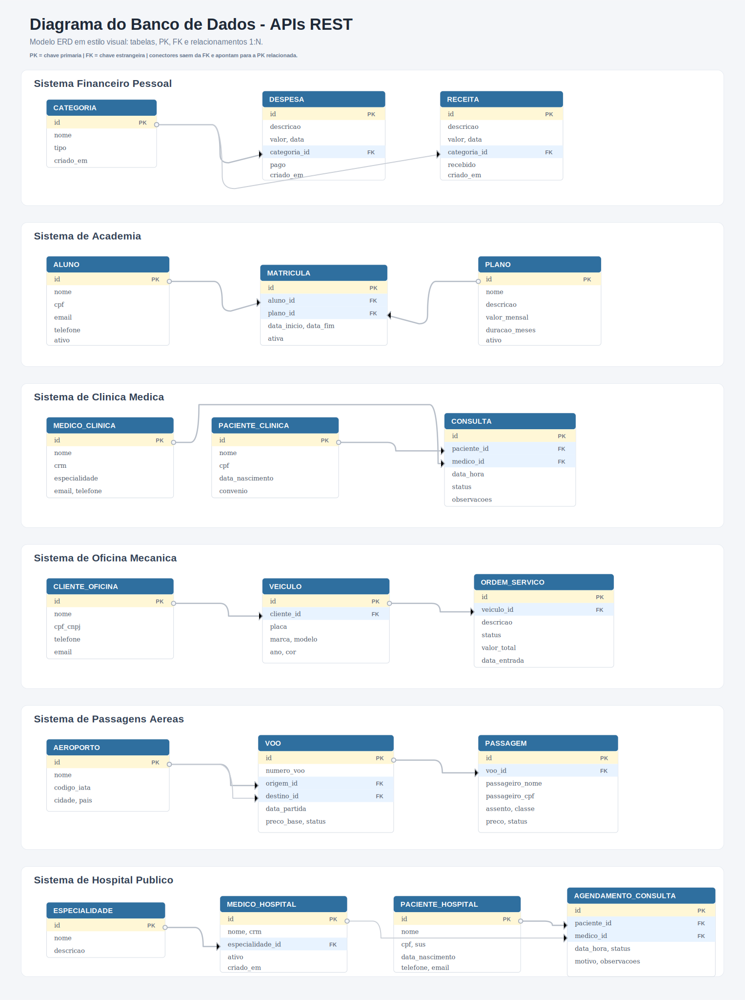

# Diagrama do Banco de Dados

Este documento apresenta a estrutura de dados das APIs REST do projeto. O diagrama abaixo usa Mermaid ERD e pode ser visualizado diretamente no GitHub.

## Diagrama ERD em Mermaid

```mermaid
erDiagram
    CATEGORIA ||--o{ DESPESA : classifica
    CATEGORIA ||--o{ RECEITA : classifica

    ALUNO ||--o{ MATRICULA : possui
    PLANO ||--o{ MATRICULA : define

    PACIENTE_CLINICA ||--o{ CONSULTA : agenda
    MEDICO_CLINICA ||--o{ CONSULTA : atende

    CLIENTE_OFICINA ||--o{ VEICULO : possui
    VEICULO ||--o{ ORDEM_SERVICO : gera

    AEROPORTO ||--o{ VOO : origem
    AEROPORTO ||--o{ VOO : destino
    VOO ||--o{ PASSAGEM : possui

    ESPECIALIDADE ||--o{ MEDICO_HOSPITAL : classifica
    PACIENTE_HOSPITAL ||--o{ AGENDAMENTO_CONSULTA : agenda
    MEDICO_HOSPITAL ||--o{ AGENDAMENTO_CONSULTA : atende

    CATEGORIA {
        bigint id PK
        string nome
        string tipo
        datetime criado_em
    }

    DESPESA {
        bigint id PK
        string descricao
        decimal valor
        date data
        bigint categoria_id FK
        boolean pago
        datetime criado_em
        datetime atualizado_em
    }

    RECEITA {
        bigint id PK
        string descricao
        decimal valor
        date data
        bigint categoria_id FK
        boolean recebido
        datetime criado_em
        datetime atualizado_em
    }

    ALUNO {
        bigint id PK
        string nome
        string cpf
        string email
        string telefone
        date data_nascimento
        boolean ativo
        datetime criado_em
        datetime atualizado_em
    }

    PLANO {
        bigint id PK
        string nome
        text descricao
        decimal valor_mensal
        int duracao_meses
        boolean ativo
    }

    MATRICULA {
        bigint id PK
        bigint aluno_id FK
        bigint plano_id FK
        date data_inicio
        date data_fim
        boolean ativa
        datetime criado_em
    }

    MEDICO_CLINICA {
        bigint id PK
        string nome
        string crm
        string especialidade
        string email
        string telefone
        boolean ativo
        datetime criado_em
    }

    PACIENTE_CLINICA {
        bigint id PK
        string nome
        string cpf
        date data_nascimento
        string email
        string telefone
        string convenio
        datetime criado_em
        datetime atualizado_em
    }

    CONSULTA {
        bigint id PK
        bigint paciente_id FK
        bigint medico_id FK
        datetime data_hora
        string status
        text observacoes
        datetime criado_em
    }

    CLIENTE_OFICINA {
        bigint id PK
        string nome
        string cpf_cnpj
        string telefone
        string email
        string endereco
        datetime criado_em
        datetime atualizado_em
    }

    VEICULO {
        bigint id PK
        bigint cliente_id FK
        string placa
        string marca
        string modelo
        int ano
        string cor
        datetime criado_em
    }

    ORDEM_SERVICO {
        bigint id PK
        bigint veiculo_id FK
        text descricao
        string status
        decimal valor_total
        date data_entrada
        date data_saida
        datetime criado_em
        datetime atualizado_em
    }

    AEROPORTO {
        bigint id PK
        string nome
        string codigo_iata
        string cidade
        string pais
    }

    VOO {
        bigint id PK
        string numero_voo
        bigint origem_id FK
        bigint destino_id FK
        datetime data_partida
        datetime data_chegada
        int capacidade
        decimal preco_base
        string status
        datetime criado_em
    }

    PASSAGEM {
        bigint id PK
        bigint voo_id FK
        string passageiro_nome
        string passageiro_cpf
        string assento
        string classe
        decimal preco
        string status
        datetime criado_em
        datetime atualizado_em
    }

    ESPECIALIDADE {
        bigint id PK
        string nome
        text descricao
    }

    MEDICO_HOSPITAL {
        bigint id PK
        string nome
        string crm
        bigint especialidade_id FK
        boolean ativo
        datetime criado_em
    }

    PACIENTE_HOSPITAL {
        bigint id PK
        string nome
        string cpf
        string sus
        date data_nascimento
        string telefone
        string email
        datetime criado_em
        datetime atualizado_em
    }

    AGENDAMENTO_CONSULTA {
        bigint id PK
        bigint paciente_id FK
        bigint medico_id FK
        datetime data_hora
        string status
        text motivo
        text observacoes
        datetime criado_em
        datetime atualizado_em
    }
```

## Relacionamentos Principais

| Sistema | Relacionamento |
|---|---|
| Financeiro | Categoria classifica muitas despesas e muitas receitas |
| Academia | Aluno e Plano se relacionam por Matrícula |
| Clínica | Paciente agenda Consulta com Médico |
| Oficina | Cliente possui Veículo, e Veículo gera Ordem de Serviço |
| Passagens | Aeroporto é usado como origem/destino de Voo, e Voo possui Passagens |
| Hospital | Especialidade classifica Médico, e Paciente agenda Consulta com Médico |
